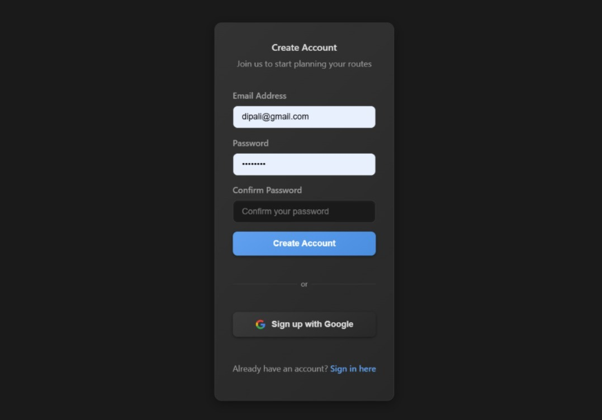
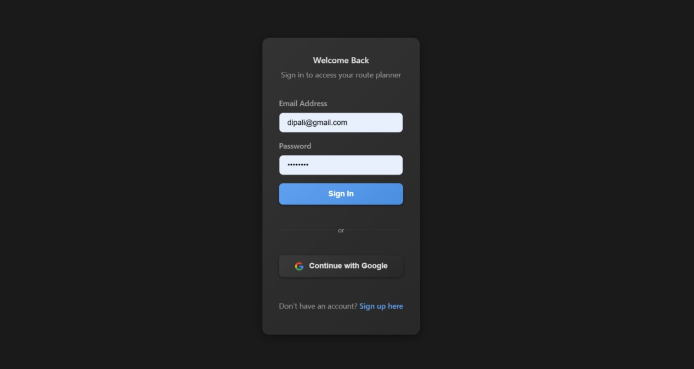
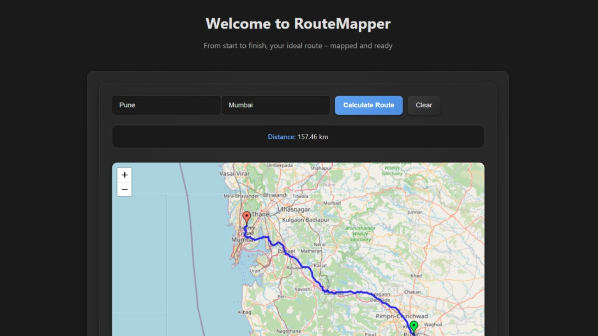
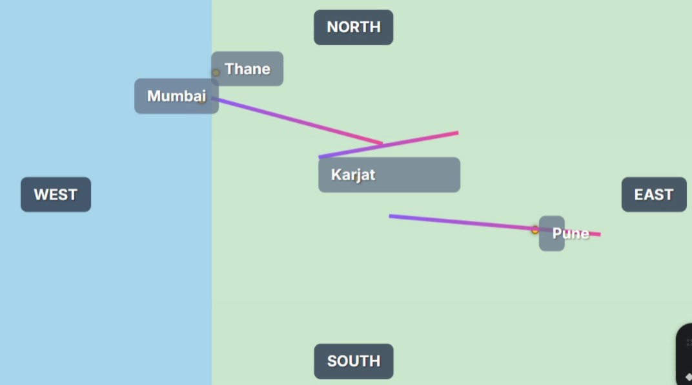

# Authenticated Map Application

An elegant React-based app that lets logged-in users explore optimized routes between two points with live map visuals and step-by-step directions.

## Preview

### 🔹 SignUp Page

## 

### 🔹 Login Page

## 

### 🔹 Map Page

## 

### 🔹 Direction Map

## 

## Features

- 🔐 **Firebase Authentication** - Email/password and Google sign-in
- 🗺️ **Interactive Maps** - Google Maps integration with route plotting
- 📍 **Location Autocomplete** - Smart location suggestions as you type
- 🎨 **Beautiful UI** - Pinkish, formal design with responsive layout
- 📱 **Mobile Friendly** - Optimized for all device sizes
- ⚡ **Real-time Routes** - Live distance and duration calculations

## Setup Instructions

### 1. Firebase Configuration

1. Go to [Firebase Console](https://console.firebase.google.com/)
2. Create a new project or use existing project
3. Go to Project Settings → General → Your apps
4. Copy your Firebase config and update `src/firebase/config.js`
5. Enable Authentication in Firebase Console
6. Enable Email/Password and Google sign-in methods

### 2. Google Maps API

1. Go to [Google Cloud Console](https://console.cloud.google.com/)
2. Enable the following APIs:
   - Maps JavaScript API
   - Places API
   - Directions API
3. Create an API key
4. Update `YOUR_GOOGLE_MAPS_API_KEY` in `src/components/MapComponent.jsx`

### 3. Installation

```bash
# Install dependencies
npm install

# Start development server
npm run dev
```

### 4. Environment Setup

Create a `.env` file in the root directory:

```env
VITE_GOOGLE_MAPS_API_KEY=your_google_maps_api_key_here
```

## Project Structure

```
src/
├── components/          # Reusable components
│   ├── LocationInput.jsx    # Smart location input with autocomplete
│   ├── MapComponent.jsx     # Main map with routing functionality
│   ├── Navbar.jsx          # Navigation bar
│   └── ProtectedRoute.jsx  # Route protection wrapper
├── contexts/           # React contexts
│   └── AuthContext.jsx     # Authentication context
├── firebase/           # Firebase configuration
│   └── config.js          # Firebase setup
├── pages/              # Page components
│   ├── Dashboard.jsx      # Main dashboard with map
│   ├── Login.jsx         # Login page
│   └── Register.jsx      # Registration page
├── App.jsx             # Main app component
├── App.css            # Styles
└── main.jsx           # Entry point
```

## Key Features 🗝️

### Authentication 🔐

- Firebase Auth with email/password and Google OAuth
- Protected routes that redirect unauthenticated users
- Persistent login state across browser sessions

### Map Functionality 🗾

- Interactive Google Maps with custom styling
- Route calculation between any two points
- Real-time distance and duration display
- Custom markers for start (A) and end (B) points

### Location Autocomplete 📍

- Google Places API integration
- Dropdown suggestions as you type
- Accurate geocoding for route calculation

### Responsive Design

- Mobile-first approach
- Breakpoints for tablet and desktop
- Touch-friendly interface elements

## Usage

1. **Sign Up/Login**: Create an account or sign in with existing credentials
2. **Enter Locations**: Type starting point and destination in the input fields
3. **Get Suggestions**: Select from dropdown suggestions for accurate locations
4. **Calculate Route**: Click "Calculate Route" to see the path on the map
5. **View Details**: See distance and estimated travel time
6. **Clear Route**: Reset the map and start over

## Technologies Used

- **React** - Frontend framework
- **CSS Grid & Flexbox** - Layout structure
- **Firebase Auth** - Google Authentication service by Firebase
- **Google Maps API** - Maps and routing api
- **React Router** - Client-side routing

## Deployment Considerations

For production deployment:

1. **Environment Variables**: Set up proper environment variables
2. **API Keys**: Restrict API keys to your domain
3. **Firebase Rules**: Configure proper security rules
4. **Build Optimization**: Use `npm run build` for production build
5. **Hosting**: Deploy to Netlify, Vercel, or Firebase Hosting
